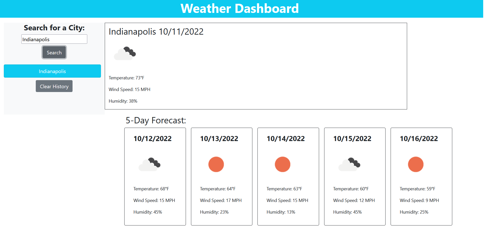

# Weather Dashboard

## Description

Created an online program that searches OpenWeather API to find the current temperature, humidity, and wind speed for the searched city as well as provides a 5-day forecast for the city. App also stores most recently searched cities in local storage and displays them as a list, each item of which the user can click on to search the city again. Finally, a button to clear the search history was added to make it easier to see the page if a long history is listed and the user doesn't want to see it anymore. 

## Preview 

## Installation

None required

## Usage

Client can use this application to find out the latest weather conditions both for the current date and for the next five days including temperature, humidity and wind speed. 

## License

N/A

## Deployed Page Link